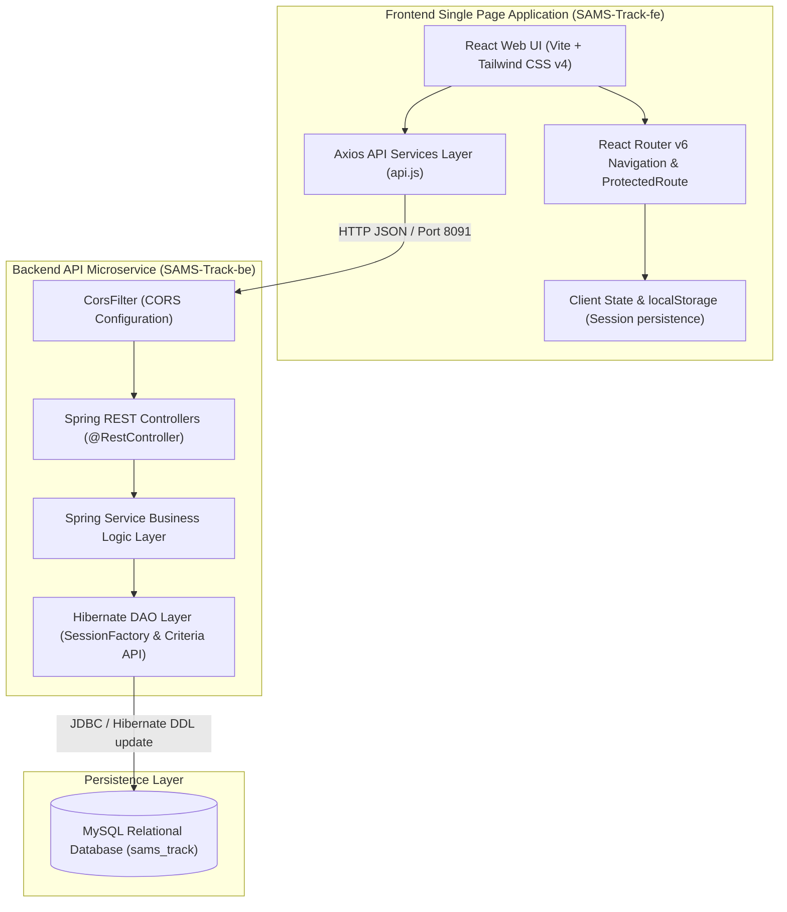
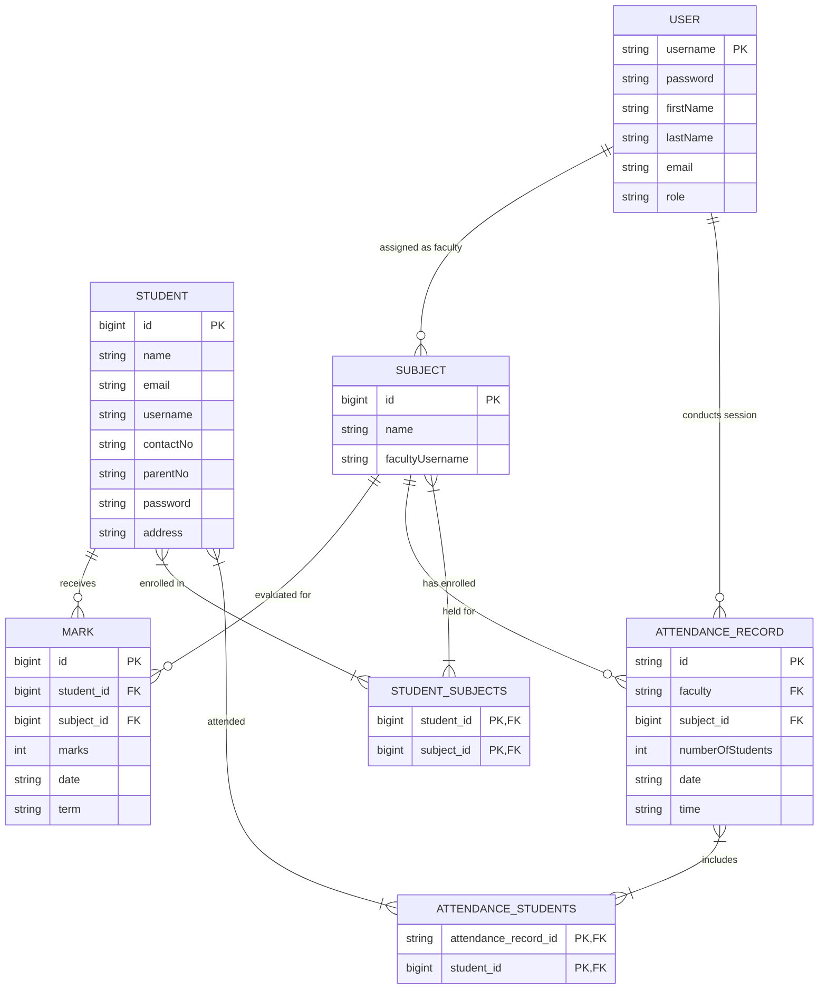
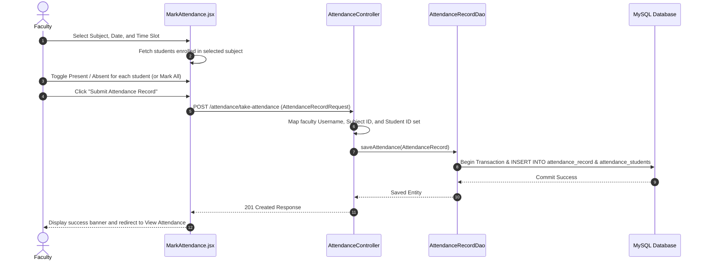

# SAMS-Track System Blueprint & Reverse Engineering Architecture (BRAIN.md)

This document serves as the absolute **Single Source of Truth (SSOT)** for the Student Attendance Management System (**SAMS-Track**). It comprehensively reverse-engineers the system architecture, business logic, authentication models, database schemas, API contracts, frontend state flows, operational behaviors, security trade-offs, and maintenance guidelines. 

Future developers and AI agents must reference this document to understand, debug, extend, refactor, test, or deploy SAMS-Track without risk of breaking unexpected system interactions.

---

## 1. Executive Summary & Core Purpose

**SAMS-Track** is a full-stack academic management platform engineered to streamline attendance logging, performance tracking, curriculum subject management, and student evaluation for educational institutions.

### Target User Personas & Permissions
1. **Administrator (`admin`)**: Manages institutional accounts (adding/updating/deleting faculty and admin credentials) and curriculum course offerings (subjects).
2. **Faculty Member (`faculty`)**: Oversees assigned subject modules, registers new students, records daily attendance sessions, logs academic evaluation marks (weekly/monthly/midterm/final), and views attendance histories.
3. **Student (`student`)**: Accesses an individual academic dashboard to view attendance statistics, track evaluation performance over time, select subject enrollments, and update profile details.
4. **Parent (`parent`)**: Reads academic progress and attendance reports linked directly to their child using parent contact validation.

---

## 2. System Architecture & High-Level Data Flow

SAMS-Track is structured as a decoupled client-server architecture. The frontend dynamic single-page application (SPA) communicates via synchronous HTTP JSON APIs with a stateless Spring Boot backend service backed by a persistent MySQL relational database.

### System Architecture Diagram



---

## 3. Technology Stack & Key Dependencies

### Backend Ecosystem (`SAMS-Track-be`)
* **Language & Runtime**: Java 17
* **Framework**: Spring Boot `2.5.6`
* **Web Modules**: `spring-boot-starter-web` (REST APIs, Embedded Tomcat)
* **ORM & Data Access**: `spring-boot-starter-data-jpa` with Hibernate `5.x` (native `SessionFactory` and legacy `Criteria API`)
* **Database Connector**: `mysql-connector-java` (Runtime scope)
* **Build Tool**: Apache Maven (`pom.xml`)
* **Containerization**: Docker (`Dockerfile` multi-stage/runtime deployment ready)

### Frontend Ecosystem (`SAMS-Track-fe`)
* **Framework & Tooling**: React `19.x`, Vite `7.x`
* **Styling & UI**: Tailwind CSS `v4` (Standardized minimalist academic design system using pure CSS utilities)
* **Icons & Visualization**: `lucide-react` (SVG icon set), `recharts` (Dynamic Area Chart progress visualizations)
* **Routing & State**: `react-router-dom` `v6` (Client-side routing with `ProtectedRoute` guards)
* **HTTP Client**: `axios` (`v1.7.9`) with environment-driven base URL fallback (`http://localhost:8091`)

---

## 4. Reverse-Engineered Authentication & Security Architecture

### 1. Multi-Role Identity Rules & Constraints
Authentication logic is handled in `UserController.java` through an polymorphic credential validation routine. Different rules apply depending on username patterns:

| Role | Username Constraint | Authentication Mechanism | Password Policy |
| :--- | :--- | :--- | :--- |
| **Admin** | Must end with `@gmail.com` | Verified against `user` database table where `role = 'admin'` | Plain text comparison |
| **Faculty** | Must be digits only (Contact Number) | Verified against `user` database table where `role = 'faculty'` | Plain text comparison |
| **Student** | Must be digits only (Student Contact No) | Verified against `student` table by `contactNo` matching username | Plain text comparison |
| **Parent** | Must be digits only (Parent Contact No) | Verified against `student` table by `parentNo` matching username | Plain text comparison |

### 2. Auto-Bootstrap Admin Credential
Upon receiving a login request for `admin@gmail.com`, if the record does not exist in the database, `UserController.java` automatically bootstraps a default super-admin record with password `admin`.

### 3. Frontend Session Management & Route Security
* **Persistence**: User role (`role`), identity (`username`), and ID (`studentId`) are stored directly in browser `localStorage`.
* **Guards (`ProtectedRoute.jsx`)**: Intercepts navigation transitions. If `username` or `role` is missing, users are redirected to `/login`. Unpermitted role routes automatically redirect users back to their respective role-based dashboards.

> [!WARNING]
> **Security Risk & Technical Debt**: 
> 1. Passwords are stored and compared in **plain text** without cryptographic hashing (BCrypt).
> 2. No stateless tokens (JWT) or HTTP-Only session cookies are issued. API requests rely on CORS configuration and client-side stored role strings.
> 3. `CorsConfig.java` allows `setAllowedOriginPatterns("*")` and `setAllowCredentials(true)`, enabling unrestricted cross-origin requests in development environments.

---

## 5. Database Schema & Entity Relationships

The relational model is auto-generated and maintained by Hibernate (`spring.jpa.hibernate.ddl-auto=update`).

### Entity Relationship Diagram (ERD)



### Key Field Specifications & Database Mapping Notes
1. **`User` Entity (`user` table)**
   * Primary Key: `username` (`String`). No surrogate integer ID.
   * Modifying a user's `username` breaks foreign key constraints in linked `Subject` (`facultyUsername`) and `AttendanceRecord` (`faculty`).
2. **`Student` Entity (`student` table)**
   * Primary Key: Auto-increment `id` (`Long`).
   * `@ManyToMany(fetch = FetchType.EAGER)` association with `Subject` via join table `student_subjects`. Eager fetching guarantees enrolled subjects are always returned with student payloads.
3. **`Subject` Entity (`subject` table)**
   * Primary Key: Auto-increment `id` (`Long`).
   * Contains loose property `facultyUsername` (`String`), matching `User.username` without an explicit JPA `@ManyToOne` join mapping.
4. **`AttendanceRecord` Entity (`attendance_record` table)**
   * Primary Key: `id` (`String`), UUID generated programmatically in default constructor (`java.util.UUID.randomUUID().toString()`).
   * Contains eager `@ManyToMany` relationship with `Student` via join table `attendance_students`.

---

## 6. Complete API Contract Matrix

The backend endpoints listen on port `8091` under `/user`, `/student`, `/subject`, `/attendance`, and `/marks`.

| Endpoint Path | Method | Purpose | Request Body / Params | Response Payload / Status |
| :--- | :--- | :--- | :--- | :--- |
| **User Controller (`/user`)** | | | | |
| `/user/login-user` | `POST` | Authenticate User/Student/Parent | `LoginRequest` (`username`, `password`) | User JSON map + `200 OK` or `401 Unauthorized` |
| `/user/register-user` | `POST` | Register Admin or Faculty user | `User` entity JSON | `"Registered"` + `201 Created` |
| `/user/get-user-by-username/{username}` | `GET` | Fetch single user details | Path Variable: `username` | `User` object |
| `/user/get-all-user` | `GET` | Fetch all user records | None | `List<User>` |
| `/user/get-all-admin` | `GET` | Filter users with role `admin` | None | `List<User>` |
| `/user/get-all-faculty` | `GET` | Filter users with role `faculty` | None | `List<User>` |
| `/user/update-user` | `PUT` | Update user profile/credentials | `User` entity JSON | Updated `User` + `200 OK` |
| `/user/delete-user-by-username` | `DELETE` | Remove user record | Query Param: `username` | `"deleted"` + `200 OK` or `404 Not Found` |
| **Student Controller (`/student`)** | | | | |
| `/student/get-all-students` | `GET` | Fetch all student rosters | None | `List<Student>` |
| `/student/add-student` | `POST` | Enroll new student profile | `Student` entity JSON | Created `Student` + `201 Created` |
| `/student/get-student-by-id/{id}` | `GET` | Fetch student details | Path Variable: `id` | `Student` object |
| `/student/update-student` | `PUT` | Update student profile | `Student` entity JSON | Updated `Student` + `200 OK` |
| `/student/delete-student/{id}` | `DELETE` | Delete student record | Path Variable: `id` | `"Deleted !!"` + `200 OK` |
| `/student/{studentId}/choose-subjects`| `POST` | Update enrolled subjects | List of subject IDs `[1, 2]` | Updated `Student` + `200 OK` |
| `/student/{studentId}/subjects` | `GET` | Fetch enrolled subjects | Path Variable: `studentId` | `Set<Subject>` |
| **Subject Controller (`/subject`)** | | | | |
| `/subject/get-all-subjects` | `GET` | List all curriculum courses | None | `List<Subject>` |
| `/subject/add-subject` | `POST` | Create new subject module | `Subject` entity JSON | Created `Subject` + `201 Created` |
| `/subject/get-subject-by-id/{id}` | `GET` | Fetch subject details | Path Variable: `id` | `Subject` object |
| `/subject/update-subject` | `PUT` | Update subject module | `Subject` entity JSON | Updated `Subject` + `200 OK` |
| `/subject/delete-subject/{id}` | `DELETE` | Remove subject record | Path Variable: `id` | `"deleted"` + `200 OK` |
| `/subject/faculty/{facultyUsername}`| `GET` | Get subjects for faculty | Path Variable: `facultyUsername` | `List<Subject>` |
| **Attendance Controller (`/attendance`)** | | | | |
| `/attendance/get-all-attendance-records` | `GET` | List all logged sessions | None | `List<AttendanceRecord>` |
| `/attendance/get-attendance-by-faculty/{username}` | `GET` | Sessions by faculty member | Path Variable: `username` | `List<AttendanceRecord>` |
| `/attendance/get-attendance-by-date-subjet/{date}/{subjectId}` | `GET` | Filter by date & subject | Path Variables | `List<AttendanceRecord>` |
| `/attendance/get-attendance/{faculty}/{subjectId}/{date}` | `GET` | Filter by faculty, sub, date | Path Variables | `List<AttendanceRecord>` |
| `/attendance/take-attendance` | `POST` | Submit attendance session | `AttendanceRecordRequest` JSON | Saved `AttendanceRecord` + `201 Created` |
| **Mark Controller (`/marks`)** | | | | |
| `/marks/get-all-marks` | `GET` | List all grade entries | None | `List<Mark>` |
| `/marks/get-marks-by-student/{studentId}`| `GET` | Grades for specific student | Path Variable: `studentId` | `List<Mark>` |
| `/marks/add-mark` | `POST` | Log academic evaluation mark | `Mark` entity JSON | Created `Mark` + `201 Created` |
| `/marks/update-mark` | `PUT` | Modify existing grade entry | `Mark` entity JSON | Updated `Mark` + `200 OK` |
| `/marks/delete-mark/{id}` | `DELETE` | Remove evaluation mark | Path Variable: `id` | `"deleted"` + `200 OK` |

---

## 7. Key Workflows & Business Logic Flows

### 1. Attendance Marking Workflow (`MarkAttendance.jsx` -> `AttendanceController.java`)



---

## 8. Frontend File Directory Mapping

```
SAMS-Track-fe/
├── src/
│   ├── assets/              # Static assets (Logos, SVGs)
│   ├── components/          # Reusable structural components
│   │   ├── AdminMenu.jsx    # Minimal navy header navigation for Administrators
│   │   ├── FacultyMenu.jsx  # Minimal navy header navigation for Faculty members
│   │   ├── Footer.jsx       # Global page footer component
│   │   ├── Logo.jsx         # SVG Brand logo element
│   │   └── ProtectedRoute.jsx # Role-based route guard component
│   ├── pages/               # Main Application Views
│   │   ├── Login.jsx        # Role-agnostic authentication gateway
│   │   ├── Profile.jsx      # User profile update portal
│   │   ├── Welcome.jsx      # System landing page
│   │   ├── admin/           # Administrative modules
│   │   │   ├── AddUser.jsx       # Faculty/Admin account registration form
│   │   │   ├── AdminDashboard.jsx # Admin stat dashboard and action panel
│   │   │   ├── AllSubject.jsx    # Curriculum management table & modals
│   │   │   ├── AllUser.jsx       # User accounts table & management
│   │   │   └── UpdateUser.jsx    # Account modification form
│   │   ├── faculty/         # Faculty management modules
│   │   │   ├── AddStudent.jsx    # Student registration form
│   │   │   ├── AllStudents.jsx   # Student directory with inline editing
│   │   │   ├── FacultyDashboard.jsx # Quick classroom actions & reports
│   │   │   ├── MarkAttendance.jsx # Interactive present/absent matrix
│   │   │   └── ViewAttendance.jsx # Attendance logging history & filter modal
│   │   └── student/         # Student & Parent portal
│   │       └── StudentDashboard.jsx # Analytics area chart & subject selection
│   ├── services/            # Axios API Abstraction Layer
│   │   ├── api.js           # Base Axios client instance configuration
│   │   ├── attendanceService.js # API methods for attendance endpoints
│   │   ├── marksService.js      # API methods for grade evaluation endpoints
│   │   ├── studentService.js    # API methods for student directory
│   │   ├── subjectService.js    # API methods for course subjects
│   │   └── userService.js       # API methods for user authentication
│   ├── App.jsx              # Central Routing definitions
│   └── main.jsx             # React DOM root entry point
├── package.json             # NPM dependencies & scripts
└── vite.config.js           # Vite build & plugin configuration
```

---

## 9. Backend File Directory Mapping

```
SAMS-Track-be/
├── src/main/java/com/tka/sams/api/
│   ├── SamsTrackApplication.java # Spring Boot main entry class (@SpringBootApplication)
│   ├── config/
│   │   └── CorsConfig.java       # Global CORS filter bean configuration
│   ├── controller/               # REST API Endpoints Layer
│   │   ├── AttendanceController.java
│   │   ├── MarkController.java
│   │   ├── StudentController.java
│   │   ├── SubjectController.java
│   │   └── UserController.java
│   ├── dao/                      # Hibernate Data Access Layer
│   │   ├── AttendanceRecordDao.java
│   │   ├── MarkDao.java
│   │   ├── StudentDao.java
│   │   ├── SubjectDao.java
│   │   └── UserDao.java
│   ├── entity/                   # JPA / Hibernate Relational Entities
│   │   ├── AttendanceRecord.java
│   │   ├── Mark.java
│   │   ├── Student.java
│   │   ├── Subject.java
│   │   └── User.java
│   ├── model/                    # Data Transfer Objects (DTOs) & Request Payloads
│   │   ├── AttendanceRecordDTO.java
│   │   ├── AttendanceRecordRequest.java
│   │   ├── LoginRequest.java
│   │   └── StudentDTO.java
│   └── service/                  # Business Logic Layer Interfaces & Implementation Services
│       ├── AttendanceRecordService.java
│       ├── MarkService.java
│       ├── StudentService.java
│       ├── SubjectService.java
│       └── UserService.java
├── src/main/resources/
│   └── application.properties    # MySQL DataSource & Server configuration
├── Dockerfile                    # Container configuration file
└── pom.xml                       # Maven build configuration
```

---

## 10. Technical Debt, Bottlenecks & Critical Maintenance Risks

Future developers and AI agents extending or refactoring SAMS-Track must pay extreme attention to the following architectural edge cases and legacy implementation patterns:

1. **Hibernate Native Session Management (`SessionFactory.openSession()`)**
   * **Behavior**: DAOs explicitly invoke `factory.openSession()`, manually open transactions (`session.beginTransaction()`), commit, and close sessions in `finally` blocks rather than relying on Spring's managed `@Transactional` annotations and `JpaRepository`.
   * **Risk**: Modifying DAO methods without adhering to the standard `try-catch-finally` session closing block will cause severe JDBC connection leaks and resource exhaustion under load.
2. **Deprecated Hibernate Criteria API Usage**
   * **Behavior**: DAO queries (e.g., `UserDao.java`, `StudentDao.java`) use legacy Hibernate `session.createCriteria(...)` and `org.hibernate.criterion.Restrictions`.
   * **Maintenance Note**: When upgrading to Spring Boot 3.x or Hibernate 6.x, this legacy Criteria API is removed and must be refactored to JPA `CriteriaBuilder` or Spring Data JPA interfaces.
3. **Eager Fetching Overhead (`FetchType.EAGER`)**
   * **Behavior**: `@ManyToMany` relations on `Student.subjects` and `AttendanceRecord.students` use `FetchType.EAGER`.
   * **Bottleneck**: Requesting large lists of students (`/student/get-all-students`) triggers extensive join queries loading entire subject graphs into memory.
4. **Date Format Standardizations**
   * **Behavior**: Dates in `Mark` and `AttendanceRecord` are stored as raw ISO `String` fields (`"YYYY-MM-DD"`) instead of SQL `java.time.LocalDate` types.
   * **Risk**: Input strings must be pre-formatted on the frontend; backend does not perform strict calendar date parsing or timezone conversions.
5. **Print Report Window Manipulation (`FacultyDashboard.jsx`)**
   * **Behavior**: Report generation temporary replaces `document.body.innerHTML` with printable HTML before calling `window.print()` and triggering a forced `window.location.reload()`.
   * **Note**: Do not remove the reload fallback after printing without replacing the DOM restoration logic, or the React application state will be destroyed.

---

## 11. Environment & Operational Deployment

### Local Development Startup

1. **Database Setup**:
   Ensure MySQL server is running locally on port `3306`. The backend configuration automatically creates the database if missing (`createDatabaseIfNotExist=true`).
   ```bash
   # Default Database URL
   jdbc:mysql://localhost:3306/sams_track
   ```

2. **Backend Execution (`SAMS-Track-be`)**:
   ```bash
   cd SAMS-Track-be
   ./mvnw spring-boot:run
   ```
   * The backend server starts on port `8091`.

3. **Frontend Execution (`SAMS-Track-fe`)**:
   ```bash
   cd SAMS-Track-fe
   npm install
   npm run dev
   ```
   * The Vite dev server starts on `http://localhost:5173`.

---

### Verification and Single Source of Truth Attestation
This `BRAIN.md` accurately captures every architectural boundary, API payload contract, security constraint, and data model present in the SAMS-Track repository. All future AI agents and software engineers must treat this document as the authoritative specification when modifying or maintaining this codebase.
