<h1 align="center">📊 SAMS - Track — Student Attendance Management System</h1>

<p align="center">
  A premium, full-stack Academic Attendance Tracker featuring dedicated role-based portals for Administrators, Faculty, Students, and Parents. SAMS-Track streamlines user management, subject allocations, real-time daily attendance recording, and parent progress monitoring.
</p>

<p align="center">
  <a href="https://github.com/SurajKarande01/SAMS-track/stargazers"></a>
  <a href="https://github.com/SurajKarande01/SAMS-track/network/members"></a>
  <a href="https://github.com/SurajKarande01/SAMS-track/issues"></a>
</p>

---

## 📌 Table of Contents
1. [Key Features](#-key-features)
2. [Tech Stack & Badges](#-tech-stack--badges)
3. [Architecture & Workflow](#-architecture--workflow)
4. [Project Structure](#-project-structure)
5. [Database Schema](#-database-schema)
6. [Backend Setup (Spring Boot)](#-backend-setup-spring-boot)
7. [Frontend Setup (React + Vite)](#-frontend-setup-react--vite)
8. [Global Free Cloud Deployment](#-global-free-cloud-deployment)
9. [API Reference](#-api-reference)
10. [Command Sheet](#-command-sheet)
11. [Author](#-author)

---

## ✨ Key Features

- **👥 Multi-Role Authorization**: 4 dedicated, protected role portals (**Admin**, **Faculty**, **Student**, **Parent**).
- **🔑 Admin Control Panel**:
  - Register, update, and manage Faculty and Admin accounts (`@gmail.com` security gateway).
  - Full CRUD operations for Students and Course Subjects.
  - Global administrative overview of all historical attendance logs.
- **📝 Faculty Portal**:
  - Record daily attendance by selecting subjects, dates, and time slots.
  - Fast interactive student checklist to mark attendance status.
  - Review and filter historical logs by subject or date.
- **🎓 Student Portal**:
  - Personalized academic dashboard to track presence percentage, registered subjects, and evaluation marks.
- **👨‍👩‍👧 Parent Portal**:
  - Secure parent login via contact number to track child's daily presence and progress metrics in real-time.
- **⚡ Modern Responsive UI**: Built with React 18, Vite, and Tailwind CSS v4 featuring sleek dark/light card designs.
- **⚙️ High-Performance Backend**: Spring Boot REST API backed by Hibernate/JPA and MySQL database with relational data integrity.

---

## 🛠️ Tech Stack & Badges

### 🖥️ Frontend
<p align="left">
  <a href="https://react.dev"></a>
  <a href="https://vite.dev"></a>
  <a href="https://tailwindcss.com"></a>
  <a href="https://reactrouter.com"></a>
  <a href="https://developer.mozilla.org/en-US/docs/Web/API/Fetch_API"></a>
</p>

### ⚙️ Backend & Database
<p align="left">
  <a href="https://spring.io/projects/spring-boot"></a>
  <a href="https://docs.oracle.com/en/java/javase/17/"></a>
  <a href="https://spring.io/projects/spring-data-jpa"></a>
  <a href="https://hibernate.org"></a>
  <a href="https://www.mysql.com"></a>
  <a href="https://maven.apache.org"></a>
</p>

---

## 🔗 Architecture & Workflow

The diagram below demonstrates how a Faculty member authenticates and registers a daily attendance sheet for a specific subject:

```mermaid
sequenceDiagram
    autonumber
    actor Faculty as Faculty (React UI)
    participant Spring as Backend (Spring Boot REST API)
    participant DB as Database (MySQL)

    rect rgb(30, 30, 40)
    Note over Faculty,DB: Authentication & Load Phase
    Faculty->>Spring: POST /user/login-user (Username & Password)
    Spring->>DB: Query user by credentials
    DB-->>Spring: Return User profile details (Role: faculty)
    Spring-->>Faculty: Return User object (localStorage cached)
    Faculty->>Spring: GET /student/get-all-students
    Spring->>DB: Fetch all registered student rows
    DB-->>Spring: List of Students
    Spring-->>Faculty: Render Student attendance sheet
    end

    rect rgb(40, 50, 60)
    Note over Faculty,DB: Record Attendance Phase
    Faculty->>Faculty: Check present students & select subject/date
    Faculty->>Spring: POST /attendance/take-attendance (AttendanceRecordRequest)
    Spring->>DB: Find Faculty (User) & Subject by IDs
    Spring->>DB: Save AttendanceRecord & populate attendance_students join table
    DB-->>Spring: Record saved successfully
    Spring-->>Faculty: Return AttendanceRecord response
    end
```



---

## 📁 Project Structure

```text
SAMS - Track/
│
├── SAMS-Track-be/                 # Spring Boot Backend Project
│   ├── src/
│   │   ├── main/
│   │   │   ├── java/com/tka/sams/api/
│   │   │   │   ├── controller/    # REST Endpoints (User, Student, Subject, Attendance)
│   │   │   │   ├── entity/        # JPA Database Entities (User, Student, Subject, AttendanceRecord)
│   │   │   │   ├── model/         # Request DTO Model Schemas
│   │   │   │   ├── repository/    # Spring Data JPA DAO Interfaces
│   │   │   │   └── service/       # Service Layer Business Logic
│   │   │   └── resources/
│   │   │       └── application.properties # Server ports & MySQL configuration
│   ├── pom.xml                    # Maven Dependency Build File
│   └── mvnw / mvnw.cmd            # Maven Wrapper Scripts
│
├── SAMS-Track-fe/                 # React + Vite Frontend Project
│   ├── src/
│   │   ├── assets/                # App Logo, Icons, and Media
│   │   ├── AddStudent.jsx         # Form to add new students
│   │   ├── AddUser.jsx            # Form to register Admins/Faculty (Admin-only)
│   │   ├── AdminDashboard.jsx     # Main portal view for Administrators
│   │   ├── AllStudents.jsx        # Data list and deletion of students
│   │   ├── AllSubject.jsx         # Subject list and addition management
│   │   ├── AllUser.jsx            # Lists registered users and controls delete operations
│   │   ├── FacultyDashboard.jsx   # Faculty workspace dashboard
│   │   ├── Login.jsx              # Role-checking Login Screen
│   │   ├── MarkAttendance.jsx     # Renders checkbox checklist for attendance
│   │   ├── ViewAttendance.jsx     # Query filters and displays previous attendance records
│   │   ├── Welcome.jsx            # Welcome landing page
│   │   ├── App.jsx                # App routes setup
│   │   ├── index.css / App.css    # Stylesheets
│   │   └── main.jsx               # Entrypoint mounting React app
│   ├── package.json               # Node dependencies and scripts
│   └── vite.config.js             # Vite development environment setup
│
└── README.md                      # Unified Project Documentation
```

---

## 🗄️ Database Schema

SAMS-Track uses Hibernate to auto-configure five synchronized database tables in MySQL:

1. **`user`**: Stores credentials and roles (`role` column supports `admin` and `faculty`).
2. **`student`**: Contains student names and email contacts.
3. **`subject`**: Stores subject profiles (e.g., *Java*, *Web Dev*).
4. **`attendance_record`**: Represents an attendance session containing the date, time, subject link, and teaching faculty.
5. **`attendance_students`**: A many-to-many join table bridging `attendance_record_id` and `student_id` to log student presence.

---

## ⚙️ Backend Setup (Spring Boot)

### 📋 Prerequisites
- **Java Development Kit (JDK)**: v17 installed
- **Apache Maven**: v3.8+ installed (or use the packaged `./mvnw` script)
- **MySQL Server**: v8.x running locally

### 🧰 Steps to Run
1. **Navigate to the backend directory**:
   ```bash
   cd SAMS-Track-be
   ```
2. **Configure your Database Details**:
   Open `src/main/resources/application.properties` and verify your MySQL credentials:
   ```properties
   spring.datasource.url=jdbc:mysql://localhost:3306/sams_track?createDatabaseIfNotExist=true
   spring.datasource.username=your_mysql_username
   spring.datasource.password=your_mysql_password
   ```
3. **Run the backend application**:
   - On Windows:
     ```powershell
     mvnw.cmd spring-boot:run
     ```
   - On macOS/Linux:
     ```bash
     chmod +x mvnw
     ./mvnw spring-boot:run
     ```
   > 📍 The backend REST API server will startup on port **`8091`** (`http://localhost:8091`).

---

## 💻 Frontend Setup (React + Vite)

### 📋 Prerequisites
- **Node.js**: v18 or newer installed
- **npm** (comes packaged with Node)

### 🧰 Steps to Run
1. **Navigate to the frontend directory**:
   ```bash
   cd SAMS-Track-fe
   ```
2. **Install project dependencies**:
   ```bash
   npm install
   ```
3. **Startup the dev environment**:
   ```bash
   npm run dev
   ```
   > 📍 The Vite UI server will launch on port **`5173`**. Access it via **`http://localhost:5173`** in your browser.

---

## 🌐 Global Free Cloud Deployment

Follow these step-by-step instructions to deploy SAMS-Track globally across **100% Free Cloud Tier** services:

### 1️⃣ Database Deployment (Free MySQL Cloud Instance)
- **Provider**: [Aiven.io](https://aiven.io) or [Render PostgreSQL/MySQL](https://render.com).
- **Steps**:
  1. Create a free account on Aiven or Railway.
  2. Provision a free MySQL database instance (service name: `sams_track`).
  3. Copy your Cloud Database Host, Port, Database Name, Username, and Password.

### 2️⃣ Backend Deployment (Render.com Free Web Service)
- **Provider**: [Render](https://render.com)
- **Steps**:
  1. Log into Render with GitHub and click **New + -> Web Service**.
  2. Connect your GitHub repository (`SurajKarande01/SAMS-track`).
  3. Select **Dockerfile** runtime (Root Directory: `SAMS-Track-be`).
  4. Under **Environment Variables**, add:
     - `SPRING_DATASOURCE_URL` = `jdbc:mysql://<YOUR_AIVEN_HOST>:<PORT>/sams_track?createDatabaseIfNotExist=true`
     - `SPRING_DATASOURCE_USERNAME` = `<YOUR_DB_USER>`
     - `SPRING_DATASOURCE_PASSWORD` = `<YOUR_DB_PASSWORD>`
  5. Click **Deploy Web Service**. Render will build the Docker container and output your live backend URL (e.g., `https://sams-track-be.onrender.com`).

### 3️⃣ Frontend Deployment (Vercel or Netlify)
- **Provider**: [Vercel](https://vercel.com) or [Netlify](https://netlify.com)
- **Steps**:
  1. Log into Vercel/Netlify using your GitHub account.
  2. Import project repository (`SurajKarande01/SAMS-track`).
  3. Set **Root Directory** to `SAMS-Track-fe`.
  4. Under **Environment Variables**, add:
     - `VITE_API_URL` = `https://sams-track-be.onrender.com` *(your live backend URL from Step 2)*.
  5. Click **Deploy**. Your React application will go live globally with SSL enabled!

---

## 🔑 API Reference

### 🧑‍💼 User & Authentication
| Method | Endpoint | Description | Query/Body params |
| :--- | :--- | :--- | :--- |
| `POST` | `/user/login-user` | Authenticate username/password | `LoginRequest` body |
| `POST` | `/user/register-user` | Register a new administrator or faculty | `User` body |
| `GET` | `/user/get-user-by-username/{username}` | Fetch a user's details | Path Variable |
| `GET` | `/user/get-all-user` | List all users in database | None |
| `GET` | `/user/get-all-faculty` | List only faculty accounts | None |
| `DELETE`| `/user/delete-user-by-username` | Delete a user profile | `?username=name` |
| `PUT` | `/user/update-user` | Update user metadata | `User` body |

### 🎓 Student Directory
| Method | Endpoint | Description | Query/Body params |
| :--- | :--- | :--- | :--- |
| `GET` | `/student/get-all-students` | Get all registered students | None |
| `POST` | `/student/add-student` | Register a new student | `Student` body |
| `GET` | `/student/get-student-by-id/{id}` | Fetch student profile | Path Variable |
| `PUT` | `/student/update-student` | Update student credentials | `Student` body |
| `DELETE`| `/student/delete-student/{id}` | Deregister student from system | Path Variable |

### 📚 Course Subjects
| Method | Endpoint | Description | Query/Body params |
| :--- | :--- | :--- | :--- |
| `GET` | `/subject/get-all-subjects` | List all available academic modules | None |
| `POST` | `/subject/add-subject` | Create new course subject | `Subject` body |
| `GET` | `/subject/get-subject-by-id/{id}` | Fetch subject details | Path Variable |
| `PUT` | `/subject/update-subject` | Update subject naming | `Subject` body |
| `DELETE`| `/subject/delete-subject/{id}` | Remove subject profile | Path Variable |

### 📅 Attendance Tracker
| Method | Endpoint | Description | Query/Body params |
| :--- | :--- | :--- | :--- |
| `POST` | `/attendance/take-attendance` | Record daily attendance sheet | `AttendanceRecordRequest` body |
| `GET` | `/attendance/get-all-attendance-records` | Fetch overall records history | None |
| `GET` | `/attendance/get-attendance-by-faculty/{facultyUsername}` | Fetch records logged by a faculty member | Path Variable |
| `GET` | `/attendance/get-attendance/{faculty}/{subjectId}/{date}` | Fetch records by faculty, subject, and date | Path Variables |

---

## 🧰 Command Sheet

| Task | Component | Command |
| :--- | :--- | :--- |
| **Run Backend Dev** | Backend | `mvnw spring-boot:run` |
| **Clean & Compile Backend** | Backend | `mvnw clean install` |
| **Build Executable JAR** | Backend | `mvnw package` |
| **Install UI Libraries** | Frontend | `npm install` |
| **Start UI Dev Server** | Frontend | `npm run dev` |
| **Build UI Static Files** | Frontend | `npm run build` |

---

## 🧑‍💻 Author

<p align="center">
  <strong>Suraj Karande</strong><br/>
  <a href="https://github.com/SurajKarande01"></a>
  <a href="https://linkedin.com/in/suraj-karande"></a>
</p>
